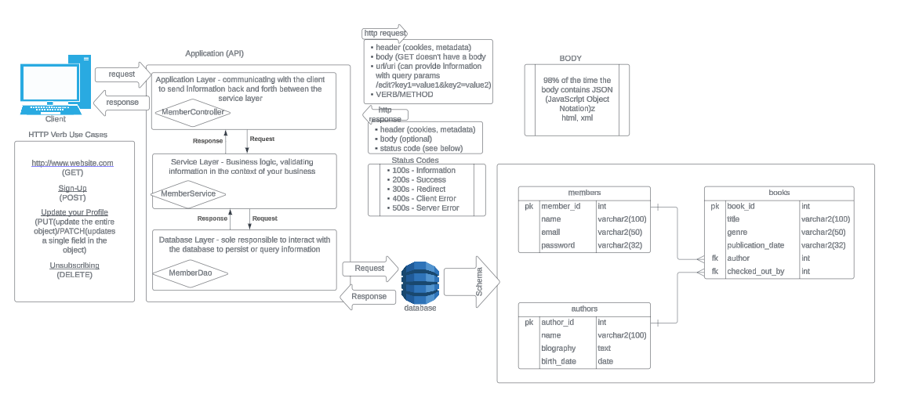

# Library Playground App

## Overview

Objective of this exercise is to begin implementation of the javalin & jdbc features for the two remaining models "Author" and "Book". Working in that order, pair up with 2-3 other developers with one driving (writing the code) and the others navigating (discussing the implementation to the driver). 

# Architecture & ERD



## Reference

Here are the two branches to reference too from your course Repo to reflect on how everything progressed for the members. If you wish to build the javalin section first before connecting to the database. 


## Steps to setting up

1. Open git bash or powershell to clone the repo and execute the following command:
```bash
git clone https://github.com/JesterCharles/library-playground.git
cd library-playground/
```
2. Execute the following command to make your own branch, using the initials of your teammates.
```bash
git checkout -b {initials}_javalin_jdbc

#Example (do not use the below)
git checkout -b cjtkhn_javalin_jdbc
```
3. Open in IntelliJ as a project, by Navigating to the folder you cloned into. You may need to load as a maven project once it finishes initializing.
4. Begin development, recommended to start with Author then follow-up with book.